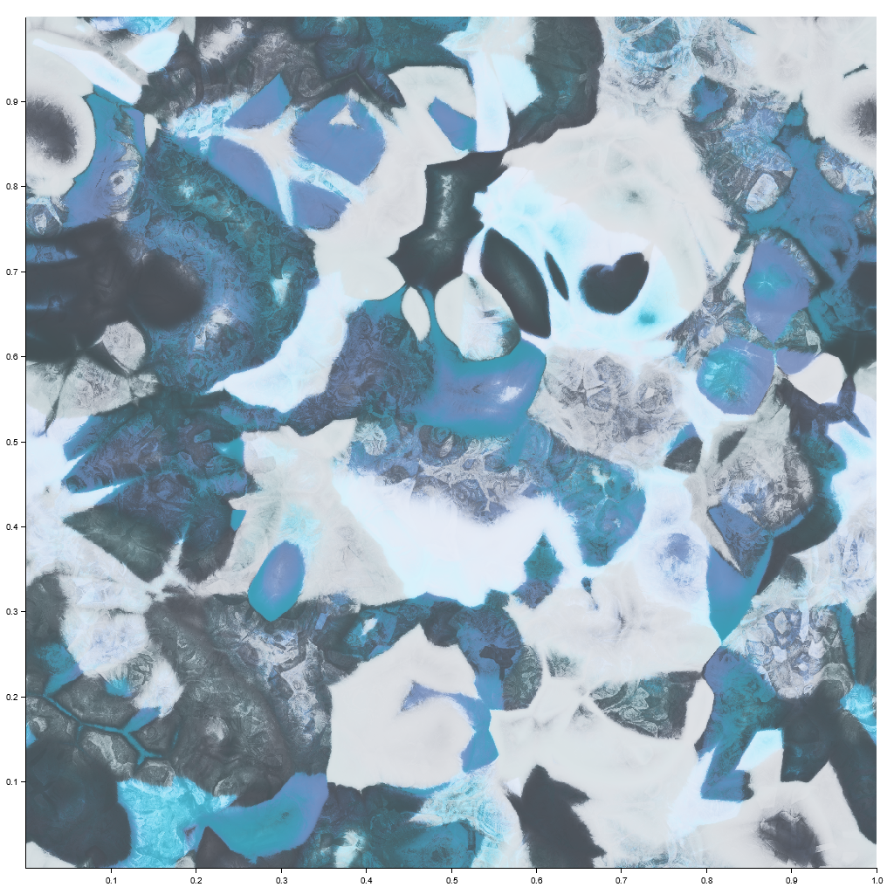

# FunUTD

## Fun Universal Texture Definitions

FunUTD is a 3-D [procedural texture](https://en.wikipedia.org/wiki/Procedural_texture) library running on the CPU.
This is an alpha version undergoing rapid development and may contain rough edges.

### Features

* Different tiling modes, including tiling of all 3 dimensions
* An endless supply of procedurally generated, self-describing volumetric textures
* Isotropic value noise, isotropic gradient noise and Voronoi bases
* Palette generation with Okhsv and Okhsl color spaces
* Interactive editor (in the example `editor`)

## Basics

The type returned by texture generators is `Box<dyn Texture>`.
`Texture` is the trait implemented by procedural textures.

The canonical range of texture values is -1...1 in each component.
This applies to the palette component as well.

Some components may slightly exceed the range, while others may come under.
Many unary nodes such as `reflect`, `vreflect` and `saturate` remap
any range back to -1...1.

Data for procedural generation is contained in `Dna` objects.
Generator functions draw whatever data they need from the supplied `Dna` object.
`Dna` objects can be constructed full of random data from a seed value.

Textures can describe themself, that is, print the code that generates them.
This is done using the `get_code` method. Obtained codes can be copied and
pasted around and subjected to further scrutiny.

### Tiling Modes

Tiling modes - whether the texture loops seamlessly for each dimension -
are implemented via a hasher parameter.

Currently implemented tiling modes are:

- `tile_none()` - none of the axes tile.
- `tile_all()` - space is filled with copies of the unit cube and texture
frequencies are rounded to the nearest whole number.
- `tile_xy()` - for each fixed `z`, the `xy` plane is filled with copies
of the unit square, while moving in the `z` dimension produces infinite variation.
Texture frequencies are rounded to the nearest whole number.

To tile a different shape than the unit cube or square:

- `tile_all_in(x, y, z)` - space is filled with copies of `(x, y, z)` sized boxes.
Texture frequencies are rounded to the nearest whole number.
- `tile_xy_in(x, y)` - for each fixed `z`, the `xy` plane is filled with copies
of `(x, y)` sized rectangles, while moving in the `z` dimension produces infinite
variation. Texture frequencies are rounded to the nearest whole number.

## Future

`Dna` objects can be mutated or crossed over to create variations of genotypes
or to optimize a texture for a purpose.

## Examples

```rust
palette(
    Space::HSL,
    0.160739,
    0.401973,
    0.250040,
    0.234684,
    displace(
        0.10390177,
        layer(
            2.4686515,
            layer(
                3.0395193,
                noise(4077839245, 11.842703, tile_all()),
                vnoise(1246086663, 12.16001, Ease::Smooth5, tile_all()),
            ),
            rotate(
                9.744911,
                vnoise(3984989388, 8.905142, Ease::Smooth5, tile_all()),
                vnoise(168447214, 5.8911786, Ease::Smooth5, tile_all()),
            ),
        ),
        reflect(
            1.884496,
            vec3(0.5632216, -0.31983083, -0.7500508),
            fractal(
                7.6917915,
                5,
                0.50210387,
                2.4051504,
                0.0,
                2.0523214,
                worley_basis(3902470283, tile_all(), 7, 10, 17),
            ),
        ),
    ),
)
```


---

```rust
palette(
    Space::HSL,
    0.550072,
    0.228674,
    0.165266,
    0.317444,
    saturate(
        8.597511,
        fractal(
            5.8026867,
            4,
            0.5642442,
            2.114186,
            0.07022904,
            1.0159429,
            displace(
                0.15992701,
                voronoi_basis(1401237949, tile_all(), 10, 25, 7),
                worley_basis(785949362, tile_all(), 0, 22, 14),
            ),
        ),
    ),
)
```



---

## License

Licensed under either of <a href="LICENSE-APACHE">Apache License, Version 2.0</a>
or <a href="LICENSE-MIT">MIT license</a> at your option.

Unless you explicitly state otherwise, any contribution intentionally submitted
for inclusion in FunDSP by you, as defined in the Apache-2.0 license,
shall be dual licensed as above, without any additional terms or conditions.
